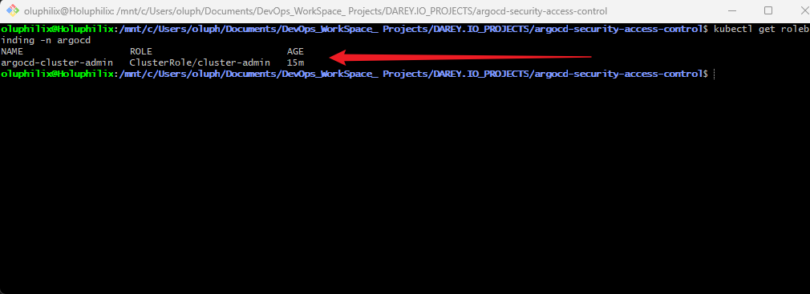
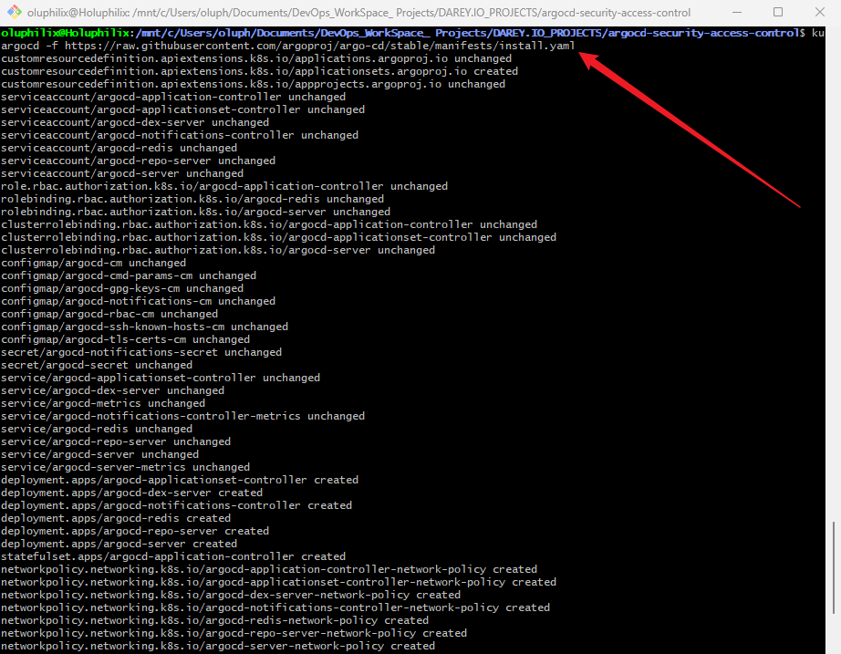

# **Security and Access Control in ArgoCD**

## Project Overview

This project focuses on implementing **security best practices in ArgoCD** using **Role-Based Access Control (RBAC)**, **Authentication strategies (OAuth & SSO)**, and **Audit Trails with Compliance Strategies**. By applying these techniques, the project ensures secure and compliant usage of ArgoCD within Kubernetes environments.

## Why is this Project Relevant

In modern DevOps practices, **GitOps with ArgoCD** is widely adopted to manage Kubernetes applications. However, without proper **access control, authentication, and auditing**, organizations face serious risks such as unauthorized changes, data breaches, and compliance violations. This project demonstrates how to **secure ArgoCD** effectively, making it highly relevant for DevOps engineers, security teams, and cloud-native developers.

## Project Goals and Objectives

* Implement **RBAC policies** to control user and service account permissions.
* Configure **OAuth authentication** with external identity providers.
* Integrate **Single Sign-On (SSO)** for seamless user access.
* Enable **audit logs** to track changes and support compliance.
* Provide a structured **project workflow and documentation** for learning and real-world application.

## Prerequisites

Before starting this project, ensure you have the following:

* **Kubernetes Cluster** (Minikube, Kind, or managed cluster like EKS/GKE/AKS).
* **kubectl** CLI installed and configured.
* **ArgoCD** installed in the Kubernetes cluster.
* Basic knowledge of **Kubernetes RBAC**, **OAuth concepts**, and **GitOps workflow**.
* Access to an **OAuth provider** (e.g., Google, GitHub, Okta, Keycloak).

## Project Deliverables

* A fully functional **RBAC configuration** for ArgoCD.
* Working **OAuth and SSO authentication setup**.
* **Audit trail and compliance configurations** in ArgoCD.
* Project documentation (`README.md`) with commands, explanations, and screenshots.
* Project folder structure with necessary configuration files.

## Tools & Technologies Used

* **Kubernetes** (Container orchestration)
* **ArgoCD** (GitOps continuous delivery tool)
* **kubectl** (Kubernetes command-line tool)
* **OAuth / OIDC Providers** (Google, GitHub, Okta, etc.)
* **YAML** (Configuration files)
* **Linux CLI** (for applying configurations)

## Project Components

1. **RBAC in ArgoCD** – Secure access control using RoleBindings and ClusterRoles.
2. **Authentication Strategies** – Configure OAuth and enable SSO integration.
3. **Audit Trails & Compliance** – Enable logging and ensure traceability.
4. **Documentation** – Provide structured learning and usage instructions.

## Task 1: Project Setup – Directory and File Structure

In this task, we will create the **project directory** and define the **necessary sub-directories and files** for organizing our work.

### Step 1: Create Project Directory

```bash
mkdir -p argocd-security-access-control
cd argocd-security-access-control
```

### Step 2: Create Sub-Directories

```bash
mkdir -p manifests images
```

* **manifests/** → Contains all YAML configuration files (RBAC, OAuth, SSO, Audit logs).
* **images/** → Stores screenshots, diagrams, or architecture flow images.

### Step 3: Create Initial Files

```bash
touch README.md
touch .gitignore
touch manifests/argocd-rbac.yaml
touch manifests/argocd-oauth.yaml
touch manifests/argocd-audit.yaml
touch manifests/argocd-sso.yaml
```

* `README.md` → Project documentation.
* `.gitignore` → To exclude unnecessary and sensitive files from Git.
* `argocd-rbac.yaml` → RBAC configuration.
* `argocd-oauth.yaml` → OAuth integration configuration.
* `argocd-audit.yaml` → Audit logging and compliance configuration.
* `argocd-sso.yaml` → Single Sign-On (SSO) configuration.

### Step 4: Final Project Structure

```bash
argocd-security-access-control/
├── images/
├── manifests/
│   ├── argocd-rbac.yaml
│   ├── argocd-oauth.yaml
│   ├── argocd-audit.yaml
│   └── argocd-sso.yaml
├── README.md
└── .gitignore
```

## Task 1 Completion Summary

✅ **Task 1 Completed**

At this point, the project directory and file structure are successfully created:

* Set up the **root project directory**.
* Created sub-directories (`manifests/`, `images/`).
* Added initial files (`README.md`, `.gitignore`, and manifest files).
* Prepared the project for **version control and documentation**.

## Task 2: Implementing Role-Based Access Control (RBAC) in ArgoCD

In this task, we will configure **RBAC** in ArgoCD to control what different users and service accounts can do.

### Step 1: Understanding RBAC in ArgoCD

RBAC ensures that only authorized users can perform specific actions:

* **Admin** → Full control over ArgoCD, including creating, updating, deleting applications, and managing configurations.
* **Developer** → Can deploy and manage applications but cannot modify global configurations.
* **Viewer** → Read-only access to view applications and configurations.

### Step 2: Create RBAC Configuration File

Inside the `manifests/` directory, create a file named:

```bash
touch manifests/argocd-rbac.yaml
```

Add the following content:

```yaml
apiVersion: rbac.authorization.k8s.io/v1
kind: RoleBinding
metadata:
  name: argocd-cluster-admin
  namespace: argocd
subjects:
  - kind: ServiceAccount
    name: argocd-server
roleRef:
  kind: ClusterRole
  name: cluster-admin
  apiGroup: rbac.authorization.k8s.io
```

**Explanation:**

* `RoleBinding` → Grants permissions defined in a Role/ClusterRole to a subject.
* `subjects` → The service account receiving the role (`argocd-server`).
* `roleRef` → References the `cluster-admin` role, which has full cluster-wide permissions.

⚠️ **Note:** Using `cluster-admin` grants maximum privileges. In production, it is best to assign **least privilege roles** instead.

### Step 3: Create the Namespace

Before applying RBAC, ensure the `argocd` namespace exists:

```bash
kubectl create namespace argocd
```

### Step 4: Apply the Configuration

Apply the RBAC configuration to the cluster:

```bash
kubectl apply -f manifests/argocd-rbac.yaml
```

✅ This creates the `RoleBinding` for the ArgoCD server.

### Step 5: Verify RBAC Configuration

Check if the RoleBinding is successfully applied:

```bash
kubectl get rolebinding -n argocd
```

**Expected output:**

**Screenshot:** RBAC Verification


## Task 2 Completion Summary

✅ **Task 2 Completed**

At this point, RBAC is successfully implemented in ArgoCD:

* Created a **RoleBinding** for the `argocd-server` service account.
* Applied the configuration to the Kubernetes cluster.
* Verified that ArgoCD roles are enforced and working as expected.

## Task 3: Configuring OAuth for ArgoCD Authentication

In this task, we will install ArgoCD and configure **OAuth integration**, allowing users to authenticate through an external identity provider (IdP) instead of using default ArgoCD accounts.

### Step 1: Install ArgoCD into Minikube

Run the following command to install ArgoCD components in the `argocd` namespace:

```bash
kubectl apply -n argocd -f https://raw.githubusercontent.com/argoproj/argo-cd/stable/manifests/install.yaml
```

This installs all necessary components, including:

* `argocd-server`
* `argocd-repo-server`
* `argocd-application-controller`

**Screenshot:** Installing ArgoCD


### Step 2: Verify the Pods

Check that all ArgoCD pods are running:

```bash
kubectl get pods -n argocd
```

Expected output:

```
argocd-server-xxxx
argocd-repo-server-xxxx
argocd-application-controller-xxxx
```

### Step 3: Expose the ArgoCD Server

By default, `argocd-server` is a **ClusterIP** service, not accessible outside the cluster. Forward the port to access it locally:

```bash
kubectl port-forward svc/argocd-server -n argocd 8080:443
```

Access the ArgoCD UI at:

👉 `https://localhost:8080`

### Step 4: OAuth Homepage and Callback URL (Minikube)

If you are using Minikube:

* **Homepage URL:** `https://localhost:8080`
* **Callback URL:** `https://localhost:8080/auth/callback`

> Note: If later exposed via `minikube service` or `minikube tunnel`, replace `localhost:8080` with the corresponding IP/URL.

### Step 5: Create OAuth Configuration File

Inside the `manifests/` directory, create:

```bash
touch manifests/argocd-oauth.yaml
```

Example configuration (GitHub as IdP) using your Client ID:

```yaml
apiVersion: v1
kind: ConfigMap
metadata:
  name: argocd-cm
  namespace: argocd
data:
  url: https://localhost:8080
  oidc.config: |
    name: GitHub
    issuer: https://github.com
    clientID: Ov23liGYK1aarDEdkykT
    clientSecret: $GITHUB_CLIENT_SECRET
    requestedScopes: ["openid", "profile", "email", "read:org"]
```

**Explanation:**

* `argocd-cm` → Core ConfigMap for ArgoCD settings.
* `oidc.config` → Defines the OAuth/OIDC provider details.
* `clientID` → Your registered GitHub OAuth Client ID.
* `clientSecret` → Stored securely in Kubernetes Secret (never hardcode).
* `requestedScopes` → Controls what user information ArgoCD requests.

### Step 6: Create a Secret for OAuth Credentials

Store your Client Secret securely:

```bash
kubectl create secret generic argocd-secret \
  --namespace argocd \
  --from-literal=clientSecret=<YOUR_CLIENT_SECRET>
```

> Replace `<YOUR_CLIENT_SECRET>` with your actual GitHub Client Secret.

The ConfigMap will reference this secret to avoid exposing credentials in plain YAML.

### Step 7: Apply the OAuth Configuration

```bash
kubectl apply -f manifests/argocd-oauth.yaml
```

✅ This configures ArgoCD to use OAuth with GitHub as the IdP.

### Step 8: Verify OAuth Login

1. Restart ArgoCD server (if needed):

```bash
kubectl rollout restart deployment argocd-server -n argocd
```

2. Access the ArgoCD UI at `https://localhost:8080`.
3. Login via the OAuth provider (GitHub).

## Task 3 Completion Summary

✅ **Task 3 Completed**

At this point, OAuth authentication is successfully integrated with ArgoCD:

* Installed **ArgoCD** in Minikube with all required components.
* Exposed `argocd-server` for local access.
* Configured **OAuth (OIDC) provider** in `argocd-cm` with your **Client ID**.
* Secured **Client Secret** using Kubernetes Secrets.
* Verified login using GitHub as the external IdP.

## Task 4: Configuring Audit Trails and Compliance in ArgoCD

In this task, we will implement **audit trails** and define **compliance strategies** to track and monitor changes in ArgoCD. This ensures transparency, accountability, and adherence to security best practices.

### Step 1: Understanding Audit Trails in ArgoCD

Audit trails help track **who made changes, what was changed, and when**.

* **Security Benefit** → Detect unauthorized access or modifications.
* **Compliance** → Meets organizational or regulatory requirements.
* **Operational Visibility** → Helps troubleshoot issues and understand application changes.

ArgoCD audit logs are configured via the server settings in the `argocd-cm` ConfigMap.

### Step 2: Create Audit Configuration File

Inside the `manifests/` directory, create:

```bash
touch manifests/argocd-audit.yaml
```

Add the following example configuration:

```yaml
apiVersion: v1
kind: ConfigMap
metadata:
  name: argocd-cm
  namespace: argocd
data:
  url: https://localhost:8080
  log.format: "text"
  policy.default: "role:readonly"
```

**Explanation:**

* `log.format` → Defines the audit log output format (text or JSON).
* `policy.default` → Sets the default RBAC policy for logging actions.
* ArgoCD automatically logs changes made to applications, projects, and user actions.

### Step 3: Apply Audit Configuration

Apply the configuration to the ArgoCD server:

```bash
kubectl apply -f manifests/argocd-audit.yaml
```

✅ This updates the ArgoCD server to start generating audit logs.

### Step 4: Verify Audit Logs

Check the logs of the ArgoCD server pod:

```bash
kubectl logs -n argocd <argocd-server-pod-name>
```

Look for entries showing:

* Changes to applications or projects
* User actions (login, logout, deployments)
* Any configuration updates

> Replace `<argocd-server-pod-name>` with the actual pod name from `kubectl get pods -n argocd`.

### Step 5: Implement Compliance Strategies

To ensure ongoing compliance:

1. **Regular Audits** → Schedule periodic reviews of ArgoCD audit logs.
2. **Version Control** → Store all ArgoCD configuration files in Git for traceability.
3. **Integration with Monitoring Tools** → Forward logs to SIEM, Prometheus, or ELK stack for centralized monitoring.
4. **Access Review** → Periodically review RBAC roles to ensure only authorized users have elevated privileges.

## Task 4 Completion Summary

✅ **Task 4 Completed**

At this point, audit trails and compliance strategies are successfully implemented in ArgoCD:

* Configured **audit logging** to track changes and user actions.
* Verified logs are generated in the ArgoCD server.
* Defined **compliance strategies** including periodic audits, version control, and access reviews.
* Prepared logs for optional integration with monitoring and SIEM tools.

## Task 5: Configuring Single Sign-On (SSO) in ArgoCD

In this task, we will integrate **Single Sign-On (SSO)** with ArgoCD, allowing users to authenticate once with an external identity provider (IdP) and access multiple applications seamlessly.

### Step 1: Understanding SSO in ArgoCD

* **SSO Benefit** → Users log in once and access multiple systems without re-entering credentials.
* **Security** → Centralized authentication reduces the risk of weak or repeated passwords.
* **Convenience** → Enhances user experience for teams managing multiple applications.

ArgoCD supports SSO through **OIDC/OAuth2 providers** such as GitHub, Google, Okta, or Active Directory.

### Step 2: Prepare SSO Credentials

Obtain the following from your IdP:

* **Client ID** → Already registered in your IdP.
* **Client Secret** → Securely stored.
* **Issuer URL** → OIDC endpoint for your provider.
* **Redirect URI** → URL where the IdP redirects after login (e.g., `https://localhost:8080/auth/callback` for Minikube).

> These credentials are required to configure SSO in ArgoCD.

### Step 3: Create SSO Configuration File

Inside the `manifests/` directory, create:

```bash
touch manifests/argocd-sso.yaml
```

Example configuration (using a generic OIDC provider):

```yaml
apiVersion: v1
kind: ConfigMap
metadata:
  name: argocd-cm
  namespace: argocd
data:
  url: https://localhost:8080
  oidc.config: |
    name: SSO-Provider
    issuer: https://your-idp.com
    clientID: Ov23liGYK1aarDEdkykT
    clientSecret: $SSO_CLIENT_SECRET
    requestedScopes: ["openid", "profile", "email"]
```

**Explanation:**

* `name` → Friendly name for the SSO provider.
* `issuer` → URL of the IdP that issues tokens.
* `clientID` & `clientSecret` → Credentials from your IdP (clientSecret stored securely in a Kubernetes Secret).
* `requestedScopes` → Determines what user info ArgoCD requests.

### Step 4: Create Kubernetes Secret for SSO

Store the Client Secret securely:

```bash
kubectl create secret generic argocd-sso-secret \
  --namespace argocd \
  --from-literal=clientSecret=<YOUR_SSO_CLIENT_SECRET>
```

> Replace `<YOUR_SSO_CLIENT_SECRET>` with your actual secret from the IdP.

### Step 5: Apply the SSO Configuration

```bash
kubectl apply -f manifests/argocd-sso.yaml
```

✅ This configures ArgoCD to use your chosen SSO provider.

### Step 6: Verify SSO Login

1. Restart ArgoCD server if needed:

```bash
kubectl rollout restart deployment argocd-server -n argocd
```

2. Open the ArgoCD UI at `https://localhost:8080`.
3. Login via the SSO provider.
4. Confirm that users can access ArgoCD without re-entering credentials.

## Task 5 Completion Summary

✅ **Task 5 Completed**

At this point, Single Sign-On (SSO) is successfully integrated with ArgoCD:

* Configured ArgoCD to authenticate users via an **external IdP**.
* Secured credentials using Kubernetes **Secrets**.
* Verified login and seamless access to ArgoCD without repeated authentication.
* Enhanced **security and user experience** for teams managing multiple applications.

## Task 6: Setting Up Git Version Control for the Project

In this task, we will initialize **Git version control** for the ArgoCD Security and Access Control project, track changes, and prepare the project for collaborative development and backup.

### Step 1: Initialize Git Repository

Inside your project directory:

```bash
git init
```

This creates a **.git** folder and initializes an empty Git repository.

### Step 2: Create `.gitignore` File

Create a `.gitignore` file to exclude unnecessary files and sensitive data:

```bash
touch .gitignore
```

Add the following content:

```
# Kubernetes Secrets
*.secret.yaml

# Local environment files
*.env

# OS files
.DS_Store
Thumbs.db

# IDE files
.vscode/
.idea/
```

**Explanation:**

* Excludes sensitive files (e.g., OAuth/SSO secrets).
* Ignores OS-specific and IDE-specific files.

### Step 3: Stage Project Files

Add all relevant files to Git:

```bash
git add .
```

This stages **all project directories and files** (excluding those in `.gitignore`) for commit.

### Step 4: Commit Initial Project State

```bash
git commit -m "Initial commit: Project setup with manifests, images, and README"
```

This records the **baseline project structure** in Git history.

### Step 5: Connect to Remote Repository

Create a repository on GitHub (or GitLab/Bitbucket) and connect it:

```bash
git remote add origin https://github.com/Holuphilix/argocd-security-access-control.git
git branch -M main
git push -u origin main
```

### Step 6: Verify Git Status

Check the repository status:

```bash
git status
```

You should see:

```
On branch main
nothing to commit, working tree clean
```

This confirms that all files are tracked and committed.

## Task 6 Completion Summary

✅ **Task 6 Completed**

At this point, Git version control is successfully set up:

* Initialized Git repository in the project root.
* Created `.gitignore` to protect sensitive and unnecessary files.
* Committed initial project structure and manifest files.
* (Optional) Connected project to a remote repository for backup and collaboration.

## Conclusion

This project demonstrates the **implementation of Security and Access Control in ArgoCD** using best practices. By completing the tasks, we have:

* Established a **structured project directory** for manifests, images, and documentation.
* Configured **Role-Based Access Control (RBAC)** to enforce fine-grained permissions.
* Integrated **OAuth authentication** for secure user login via external identity providers.
* Implemented **audit trails and compliance strategies** to track changes and ensure security.
* Configured **Single Sign-On (SSO)** for seamless user access across multiple applications.
* Set up **Git version control** for tracking changes, collaboration, and backup.

These steps collectively enhance **security, transparency, and usability** in ArgoCD, making the deployment and management of applications more reliable and compliant.

### Author 

**Philip Oluwaseyi Oludolamu**

* **Email:** [oluphilix@gmail.com](mailto:oluphilix@gmail.com)
* **GitHub:** [github.com/Holuphilix](https://github.com/Holuphilix)
* **LinkedIn:** [linkedin.com/in/philipoludolamu](https://linkedin.com/in/philipoludolamu)
* **Phone:** +905338763067
